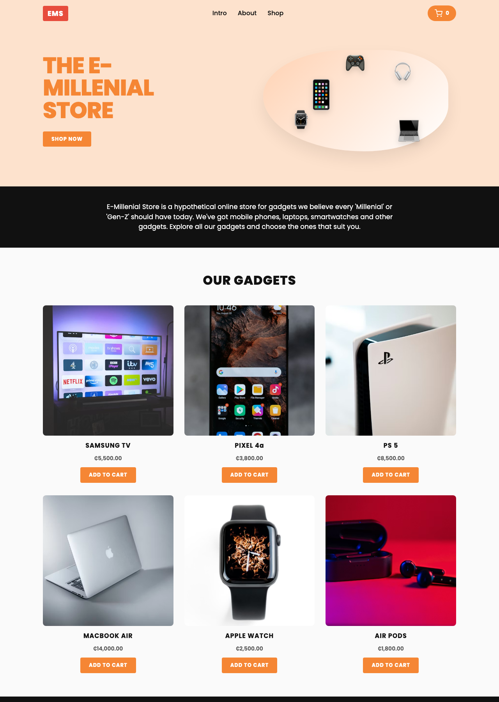
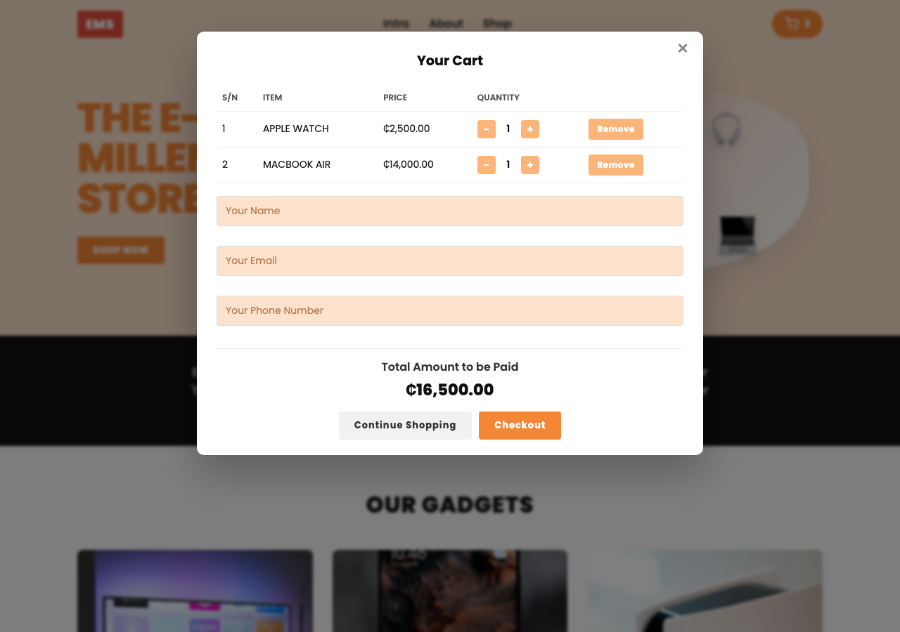
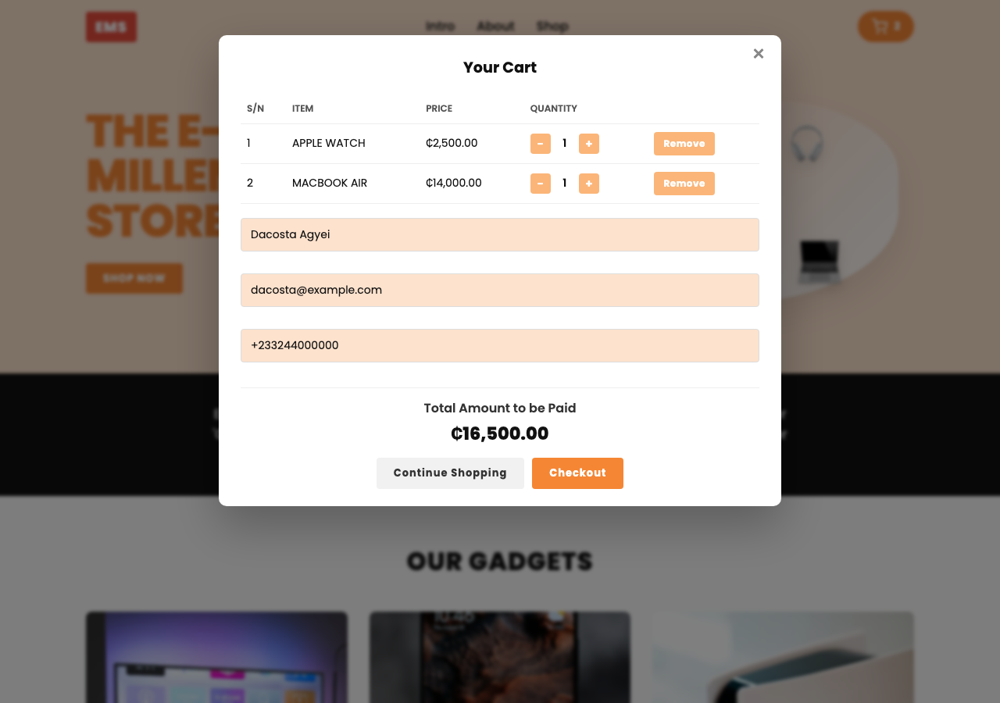

# The E-Millenial Store (EMS)

> Frontend Capstone Project — **Fullstack Development (Python)** Microdegree
> Ghana Digital Centres Limited (Centre 1) · 2026 Q1, Cohort 1 (May 11 – Jul 3, 2026)
> Designed and Crafted by **Dacosta Agyei**

A simple, responsive e-commerce website for gadgets with a working shopping
cart and **Paystack** checkout (Test Mode). Built end-to-end with vanilla
HTML, CSS, and JavaScript — no frameworks, no build step.

## Live demo

Just open it in the browser.

---

## Screenshots

### Landing page


### Shopping cart


### Checkout — form filled, ready for Paystack


---

## Features

All 12 requirements from the project brief are implemented:

| # | Requirement | Implementation |
|---|---|---|
| 1 | Landing page with Intro / About / Shop / Footer | `index.html` sections |
| 2 | Products in gallery / grid format | CSS Grid in `.product-grid` |
| 3 | Add any product to cart | `toggleProductInCart()` |
| 4 | Remove from cart on landing OR in modal | shared `cart` state, both buttons re-sync |
| 5 | Inc / dec quantity — total updates live | `qty-btn` handlers + `renderCart()` |
| 6 | Form validates each field before checkout | `validateField()` runs on blur and on submit |
| 7 | Total reflects sum of price × qty | `getCartTotal()` |
| 8 | Cart badge = **number of items**, not quantity | `Object.keys(cart).length` |
| 9 | Paystack checkout — Test Mode | `startPaystack()` using `PaystackPop.setup()` |
| 10 | Summary modal with dynamic name + items | `showSummary()` |
| 11 | Cart cleared after successful purchase | `handleSummaryDismiss()` |
| 12 | Responsive | 3-col → 2-col → 1-col + collapsing nav |

**Currency:** Ghana Cedis (₵ / GHS). All Paystack amounts are converted to pesewas before submission.

---

## Project structure

```
.
├── index.html         # Markup — intro, about, shop, cart modal, summary modal
├── styles.css         # All styles + responsive breakpoints
├── script.js          # Cart logic, validation, Paystack, summary
├── products.js        # Products list (single source of truth)
├── screenshots/       # README assets
│   └── landing.png
├── README.md
└── .gitignore
```

HTML, CSS and JavaScript live in separate files as required by the brief.
Inside `script.js`, each responsibility is a named function:
`renderProducts`, `toggleProductInCart`, `syncProductButtons`,
`updateCartBadge`, `renderCart`, `validateField`, `validateForm`,
`startPaystack`, `showSummary`, `handleSummaryDismiss`.

---

## Setting up your Paystack Test Key

The Paystack flow ships with a placeholder key and a safe simulated-success
fallback so the rest of the project still demos. To enable the real Paystack
modal (Test Mode):

1. Sign in at <https://dashboard.paystack.com> (Ghana accounts supported).
2. Toggle to **Test Mode** (top of the dashboard).
3. Go to **Settings → API Keys & Webhooks**.
4. Copy your **Test Public Key** — starts with `pk_test_…`.
5. Open `script.js` and replace:

   ```js
   const PAYSTACK_PUBLIC_KEY = "pk_test_REPLACE_WITH_YOUR_KEY";
   ```

   with your key.

6. Reload the page. Checkout now opens the real Paystack modal.

### Paystack test card

| Field | Value |
|---|---|
| Card | `4084 0840 8408 4081` |
| CVV | `408` |
| Expiry | any future date |
| PIN | `0000` |
| OTP | `123456` |

---

## How a purchase flows

1. User clicks **ADD TO CART** on a product — the button flips to
   **REMOVE FROM CART** and the cart badge increments.
2. User opens the cart, adjusts quantities, fills in name / email / phone.
3. On **Checkout**, every form field is validated. If anything fails, the
   offending input gets the `.invalid` class and a red error message.
4. Paystack inline modal opens with the cart total (converted to pesewas)
   and customer metadata.
5. On `callback`, the **Summary modal** appears with a personalised greeting
   and a table of items + quantities purchased.
6. The **Ok** button clears the cart, resets the form, and reloads the page
   to a clean state.

---

## Coursework context

| | |
|---|---|
| Learning Path | Fullstack Python Developer |
| Provider | starttocode |
| Partner | Ghana Digital Centres Limited — Centre 1 |
| Cohort | 2026 Q1 · Cohort 1 |
| Dates | May 11, 2026 — Jul 3, 2026 |
| Modules completed | Intro · HTML · CSS · JavaScript · Capstone (Frontend) |

---

## Credits

Designed and Crafted by **Dacosta Agyei**.
Project brief and base UI direction from the **starttocode** Fullstack Python
Developer microdegree (Capstone — Frontend).
